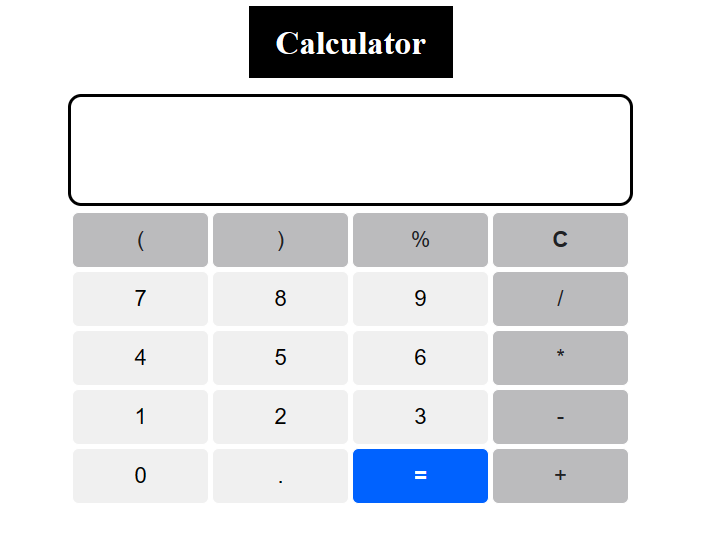

# Calculator-JS

A Calculator is built utilizing HTML, CSS, JavaScript. It has an ability to perform Arthematic operations like Addition, Subtraction, Multiplication and Division.

### Snapshot of the output

### Future Work:
<ul>
<li>Add a functionality to accept input from keyboard and evaluate the expression </li>
<li>Display error message when illegal expression being used, utilizing try and catch method </li>
<li>Displaying the history </li>
<li>add ability to evaluate () </li>
</ul>
